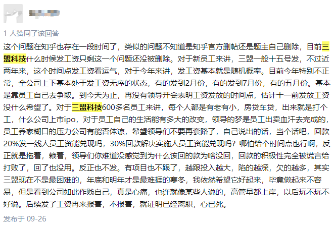

# sunmnet-back-pay（三盟科技欠薪）
三盟科技股份有限公司，拖欠工资，欠薪收集。

1. 三盟科技长期拖欠工资
2. 相关帖子被删除，故作此备份
3. 只是一小部分
4. 持续更新

## 截图

## 相关帖子收集

### 1. 三盟科技什么时候发工资?

#### 评论1	

这个问题在知乎也存在一段时间了，类似的问题不知道是知乎官方删帖还是题主自己删除，目前三盟科技什么时候发工资只剩这一个问题还没被删除。对于新员工来讲，三盟一般十五号发，不过近两年来，这个时间点发工资看运气，对于今年来讲，发工资基本就是随机概率。目前今年特别不正常，全公司上下基本处于发工资无序的状态，有的发到2月份，有的发到7月份，有的五月份。基本是靠员工自己去争取。到今天为止，再没有领导开会表明工资发放的时间点，估计十一前发放工资没什么希望了。对于三盟科技600多名员工来讲，每个人都是有老有小，房贷车贷，出来就是打个工，什么公司上市ipo，对于员工自己的生活能有多大的改变，领导的梦是员工出卖血汗去完成的，员工养家糊口的压力公司有能否体谅，希望领导们不要再套路了，自己说出的话，当个话吧，回款20%发一线人员工资能兑现吗，30%回款解决实施人员工资能兑现吗？哪怕给个时间点也行啊，反正就是拖着，赖着，领导们你难道没感觉到为什么该回的款为啥没回，回款的积极性完全被谎言给打败了，回了也没用。反正也不发。有项目也不跟了，越跟投入越大，陷的越深，欠的越多，其实三盟现在不是最困难的，年底和明年才是最难捱的寒冬，我依然希望它好起来，毕竟做起来不容易，但是看到公司如此作贱自己，真是心痛，也许就像某些人说的，高管早都上岸，以后玩不玩不好说。后续发了工资再来报喜，不报喜，就证明已经离职，心已死。

> 发布于 2021-09-26

#### 评论2	

马上脱坑了.简单说一下吧.从入职以来,就没有准时发放过工资.入职的时候说是15号发放.月初入职第一个月的工资是次月的月底发的.我以为是特殊情况因为事先也大过招呼.结果发现这居然是最好的情况往后几个月恰逢过年期间.也不便找工作.就这样因为一直拖欠.最严重的时候是拖欠了3个月工资了.好在目前所在区域在慢慢回款.这几个月陆陆续续补上了欠薪.不过仍然还没有结清薪资.后来则看此贴慎重考虑.每个区域情况都不同.你要做好拖欠薪资的准备(个人建议面其他公司)

> 发布于 2021-09-27

#### 评论3

后悔来这个公司了

> 发布于 2021-09-06

#### 评论4

太艰难了，到目前为止，5月工资还没发，房贷，生活压力太大了

> 发布于 2021-09-27

#### 评论5

已经持续近两年保持拖欠工资3个月以上了...

> 发布于 2021-09-24

### 2.  三盟科技公司怎么样？

#### 评论1

三盟这两年一直都在拖欠工资

> 发布于 2021-09-30

#### 评论2

过来人经验，可以考虑其他的机会。目前公司拖欠严重。

> 发布于 2021-09-29

#### 评论3

拖欠工资没诚信两年了，你还敢来吗?

> 发布于 2021-09-29

#### 评论4

每次开会都说项目回款的20%作为销服工资发放30%作为研发团队发放，项目回款两周可以发工资，实际是等了一个多月工资都没有消息，好像是回款一到账就被...

> 发布于 2021-09-23

### 3. 三盟科技还我血汗钱

#### 评论1

除了拖欠工资和报销，确实没啥问题，这不又开始给省总发期权了。。。因为公司确实没啥发的了。。期权确...

> 发布于 2021-10-01

### 4. 三盟科技离职能拿到拖欠的工资吗?

#### 评论1	

昨晚的会，真是无耻到极点。员工的家庭都快支离破碎了，公司依然要保证员工能够出差的义务，光说体谅公司，领导考虑过体谅600多个家庭吗?

> 发布于 2021-09-30

#### 评论2

想什么呢!离职了还想拿到工资，在职的都欠薪4个月了。

> 发布于 2021-09-29

#### 评论3

离职1个月，没有收到1分工资，还拖欠3个月工资...已经持续快两年了，希望能够止损...

> 发布于 2021-09-29

#### 评论4

一样的，离职几个月了，还有工资没结清

> 发布于 2021-09-29

### 5. 三盟科技又来删帖了，兄弟们没事多多爆料?

#### 评论1

都不知道公司在想什么，删帖能解决问题吗？当务之急是把工资给发了，否则公司员工怨声载道，接下来可就不是发发贴那么简单了。

> 发布于 2021-10-15

#### 评论2

​	

