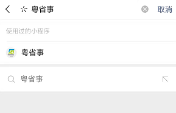
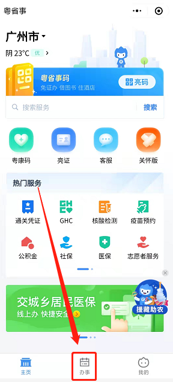
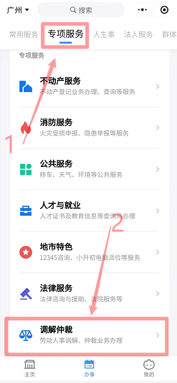
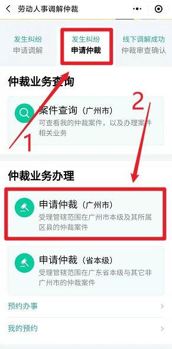
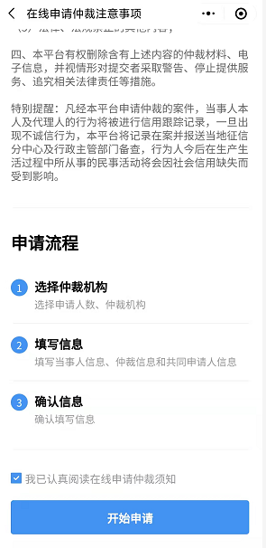
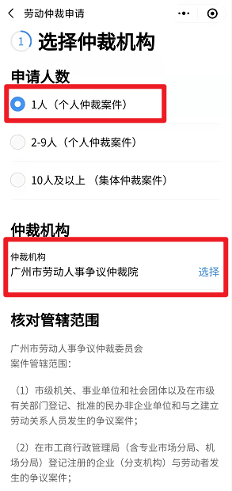
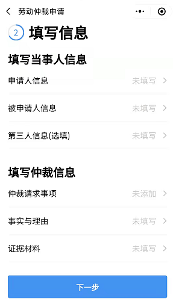
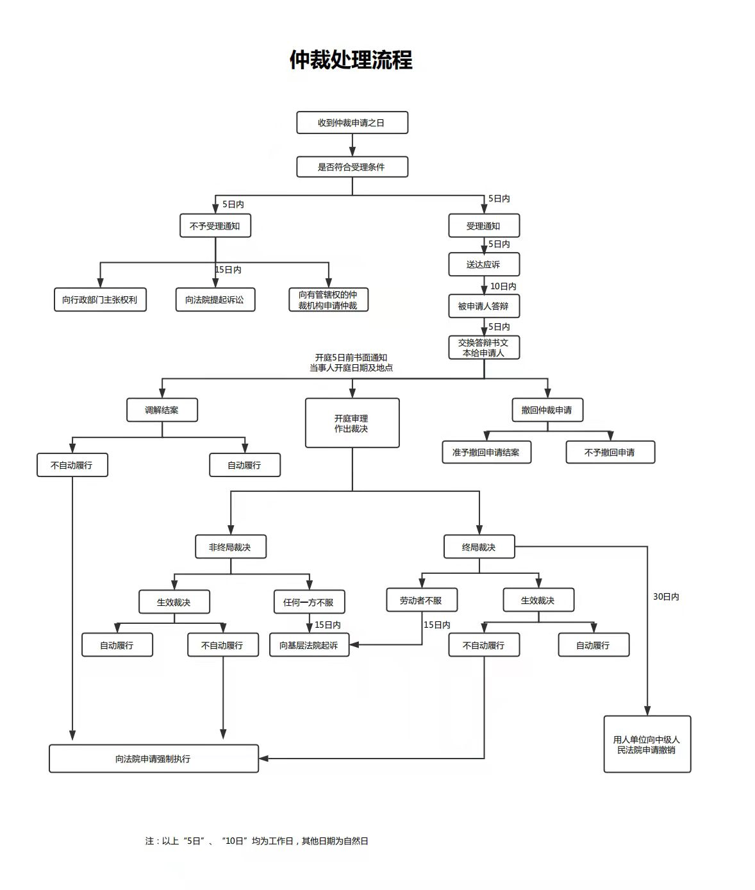

# 三盟科技欠薪仲裁参考

## 概述

1. 由于三盟科技长期拖欠员工工资，故需要做好仲裁准备
2. 帮助需要仲裁三盟科技的同事些许方向及指导
3. 提供仲裁三盟科技所需知识及材料
4. 仲裁三盟科技流程及时间（<=45天）

## 如何提起仲裁

> 有微信就行

1. 打开微信搜索【粤省事】小程序

2. 进入粤省事点击【办事】 --> 【专项服务】 --> 【调解仲裁】

3. 开始进入仲裁申请，点击【申请仲裁】 --> 【申请仲裁（广州市）】

   

4. 开始申请仲裁

   

## 仲裁流程

## 相关材料

1. [仲裁申请书-劳动者诉单位](docs/仲裁申请书-劳动者诉单位.docx)
2. [证据清单](docs/证据清单.xls)
3. [当事人有效送达地址确认书](docs/当事人有效送达地址确认书.doc)
4. [三盟企业信息](docs/三盟企业信息.pdf)

## 总结

1. 仲裁全程申请还是比较简单的
2. 时间一般45天即可
3. 仲裁需要提供相关证据
4. 仲裁不需要不用耽误太多时间（半天即可）